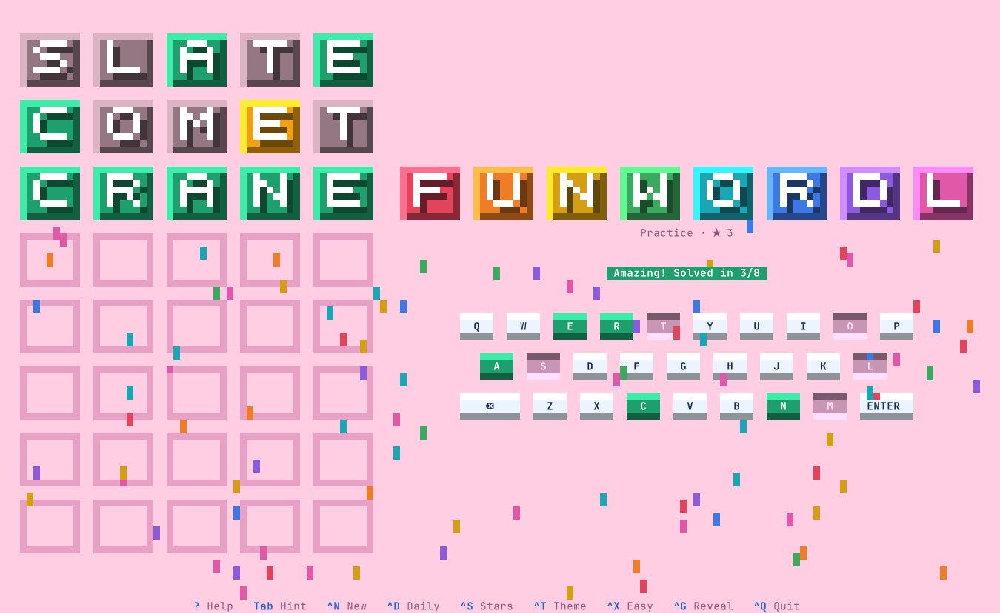
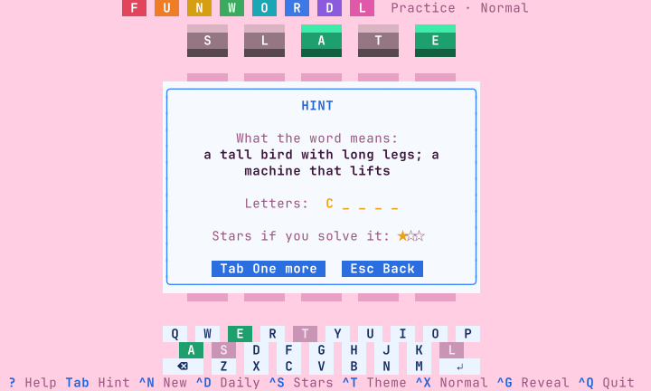

# funwordl

A playful Wordle-style word game for the terminal, made for children. Guess the hidden
five-letter word, with sounds and confetti; collect stars and the words you have
learned; ask for a hint when you are stuck.



- **Hints that teach.** The first hint is what the word means. After that, a letter
  at a time.
- **An Easy level.** Eight guesses, and a word that is not solved costs nothing. It
  is one key away from Normal, where the game starts; two harder levels are beyond.
- **Sounds.** A note for every tile as a guess is turned over, higher the closer it
  is, and a little tune for a solved word. One key switches them off.
- **Stars and a collection.** A solved word earns up to three stars. Every word you
  meet is kept, with its meaning, to leaf through later.
- **Confetti**, and twenty-one color themes: fifteen bright ones, from pink through
  red, orange, yellow, green and purple to blue, and five dark ones.
- **Fills the terminal and follows its size.** Big pixel-art tiles on a large
  terminal, single characters on a small one.
- **Keyboard first, mouse welcome.** Everything has a key; the on-screen keyboard and
  every button can also be clicked.
- **Words chosen for children**, each with a short, plain meaning.



funwordl is the playful sibling of [wordl](https://github.com/anwarahmed/wordl) and is
built on the same rules and the same words. If you want the plain game, with no
sounds, stars or hints, that is wordl. Both can be installed side by side; each keeps
its own stars and statistics.

## Install

funwordl runs on macOS and Linux, on Intel and ARM. It is a single program with
nothing else to install; the terminal needs UTF-8, which every current one has.

### Homebrew (macOS and Linux)

```sh
brew install anwarahmed/tap/funwordl
```

Update with `brew upgrade funwordl`, remove with `brew uninstall funwordl`.

### Install script

```sh
curl -fsSL https://raw.githubusercontent.com/anwarahmed/funwordl/main/install.sh | sh
```

This downloads the latest release for your machine, checks its checksum, and puts it
in `~/.local/bin` (set `FUNWORDL_BIN_DIR` for somewhere else). A copy installed this
way keeps itself up to date (see [Updates](#updates)). Where there is no prebuilt
binary it builds from source instead, which needs Rust. To remove the game:

```sh
curl -fsSL https://raw.githubusercontent.com/anwarahmed/funwordl/main/install.sh | sh -s -- --uninstall
```

### Arch Linux

Each [release](https://github.com/anwarahmed/funwordl/releases/latest) carries a
`PKGBUILD` for the package `funwordl-bin`. Download it into an empty directory and
build:

```sh
curl -fsSLO https://github.com/anwarahmed/funwordl/releases/latest/download/PKGBUILD
makepkg -si
```

Remove it with `sudo pacman -R funwordl-bin`. (The package is not in the AUR yet.)

### From source

Needs Rust 1.88 or newer.

```sh
git clone https://github.com/anwarahmed/funwordl
cd funwordl
cargo run --release
```

`./install.sh --source` builds and installs in one step; `./install.sh --link` links
`~/.local/bin/funwordl` to the checkout's build, for development.

## Updates

| Installed with | How it updates |
| -------------- | -------------- |
| Install script | By itself: when it starts it checks for a newer release, at most once a day, installs it and restarts |
| Homebrew       | `brew upgrade funwordl` |
| Arch package   | Build the newer `PKGBUILD` the same way |
| From source    | `git pull`, then build again |

Only the install script's copy updates itself. A copy that Homebrew or pacman owns is
marked as theirs when it is installed and never touches its own file, and neither does
a build run from a checkout.

For a copy that updates itself:

```sh
funwordl update        # check now and install a newer release
funwordl update off    # stop checking at startup ("on" turns it back on)
```

`FUNWORDL_NO_UPDATE=1` skips the check for one run. The check at startup happens at
most once a day (`funwordl update` always checks), waits at most three seconds, and
says nothing when you are offline. An update is verified against the release's SHA-256
checksum and never moves to an older version; if anything fails, the version you have
starts as usual.

## Play

Type a five-letter word and press Enter. Each tile then tells you how close you were:

| Tile   | Meaning                                 |
| ------ | --------------------------------------- |
| Green  | the letter is in the word, in this spot |
| Yellow | the letter is in the word, elsewhere    |
| Gray   | the letter is not in the word           |

The on-screen keyboard keeps track of what you know about each letter.

| Key         | Action                                         |
| ----------- | ---------------------------------------------- |
| `A`-`Z`     | type a letter                                  |
| `Enter`     | guess                                          |
| `Backspace` | delete a letter                                |
| `Tab`       | a hint (on Easy and Normal)                    |
| `?` or `F1` | help                                           |
| `Ctrl-N`    | new game with a random word                    |
| `Ctrl-D`    | today's daily puzzle                           |
| `Ctrl-S`    | your stars                                     |
| `Ctrl-W`    | your words                                     |
| `Ctrl-T`    | next color theme                               |
| `Ctrl-X`    | next level                                     |
| `Ctrl-A`    | sound on or off                                |
| `Ctrl-G`    | show the word and end the game                 |
| `Ctrl-L`    | redraw the screen                              |
| `Ctrl-Q`    | quit                                           |

### Levels

`Ctrl-X` goes round four levels. The game starts on Normal and remembers the one you
choose.

- **Easy** - eight guesses, and hints. A word you do not solve is not counted against
  you and does not end a run of solved words.
- **Normal** (where the game starts) - six guesses, and hints. Guesses must be real
  words.
- **Hard** - no hints, and green letters must stay where they are and yellow letters
  must be used again.
- **Ultra Hard** - also: a yellow letter must move to another spot, and a gray letter
  can't be played again (beyond the copies already shown as green or yellow).

A guess that breaks a rule is refused with the reason. A game that is under way can be
made easier at any time; a harder level starts with the next word, unless nothing has
been guessed or hinted yet.

### Hints

On Easy and Normal, `Tab` opens the hints for the word. The first is what the word means. `Tab`
again, inside the hint window, gives one of its letters, up to three; a letter you
were given waits faintly in its spot on the board until you type over it. Opening the
window again later shows the hints you already have and takes no new one.

### Stars

A solved word earns three stars. Each hint costs one, but a solved word always earns
at least one. Your stars add up across every game, and the title line shows the total.

### Your words

Every word you finish, solved or not, goes into your collection with its meaning and
the most stars you have earned for it. `Ctrl-W` opens it (or `W` from the stars
window); the arrow keys turn from one word to the next.

### Practice and the daily puzzle

Every launch, and every `Ctrl-N`, starts a practice game with a new random word. The
daily puzzle (`Ctrl-D`, or `funwordl --daily`) is one word a day, the same for
everyone on the same date; it is the one game that is picked up where you left it,
hints included. It is not the same word as wordl's daily puzzle.

### Showing the word

`Ctrl-G` ends a game that is going nowhere. The game asks first, then shows the word
on the board and its meaning. On Easy that costs nothing; on the other levels the
game counts as played and not solved. `N` then starts the next word.

### Sound

The game makes a few sounds: a note for each tile as a guess is turned over (high for
green, middle for yellow, low for gray), a short tune when a word is solved, and small
ones for a hint, a refused guess and a word not solved.

`Ctrl-A` switches sound off and on, and the game remembers it. `--no-sound`, or
`FUNWORDL_NO_SOUND=1`, plays one game without.

A terminal cannot play sounds itself, so the game hands them to the player your system
already has: `afplay` on macOS; `pw-play`, `paplay` or `aplay` on Linux (PipeWire,
PulseAudio or ALSA). If none is installed the game is silent and `Ctrl-A` says so.
Over SSH the sound comes out of the machine the game runs on, not the one you are
sitting at.

### Themes

`Ctrl-T` steps through twenty-one of them, and `--theme` starts with one.

Bright, each with colors chosen to go with its background:

| Theme      | Background  | With it                  |
| ---------- | ----------- | ------------------------ |
| `candy`    | pink        | baby blue (the default)  |
| `coral`    | coral red   | teal, navy and cream     |
| `cherry`   | red         | teal and mint white      |
| `ruby`     | deep red    | gold, with light writing |
| `sunset`   | orange      | teal and sienna          |
| `lemon`    | yellow      | blue-gray and brick      |
| `mint`     | mint green  | raspberry                |
| `meadow`   | fresh green | purple                   |
| `sage`     | sage green  | cream and rust           |
| `lavender` | lavender    | peach and gold           |
| `orchid`   | orchid      | green                    |
| `grape`    | deep purple | gold, with light writing |
| `sky`      | blue        | orange and cream         |
| `paper`    | cream       | terracotta and slate     |
| `daylight` | white       | blue                     |

Dark: `midnight`, `neon`, `contrast`, `ocean` and `ember`.

And `terminal`, which uses only your terminal's own 16 colors, so it follows your
terminal theme.

On every theme a letter in the right spot is green and one in the wrong spot is yellow
or orange, in shades that suit the background. A letter that is not in the word is
gray on the dark themes and a darker shade of the background on the bright ones. The
exception is `contrast`, which uses orange and blue instead of green and yellow, for
color-blind players.

### Terminal size

The game redraws itself when the window is resized and picks the largest board that
fits. The smallest usable size is 39 columns by 12 rows, and 39 by 14 on Easy, whose
board is two rows taller (a wide terminal can be shorter
still). Truecolor is used when the terminal announces it (`COLORTERM`), 256 colors
otherwise.

While the game runs it captures the mouse, so selecting text in the terminal needs
Shift (Option in macOS Terminal).

## Options

```
funwordl [options]        play
funwordl update           check for a newer release now and install it
funwordl update off | on  stop, or resume, checking when the game starts
funwordl --help | --version | --licenses

  -p, --practice            start with a new random word (default)
  -d, --daily               start with today's puzzle
  -t, --theme NAME          bright: candy, coral, cherry, ruby, sunset, lemon, mint,
                            meadow, sage, lavender, orchid, grape, sky, paper, daylight
                            dark: midnight, neon, contrast, ocean, ember
                            or terminal, which follows your terminal's colors
      --easy                eight guesses, and hints with Tab
      --normal              six guesses, and hints with Tab (default)
      --hard                no hints; green letters stay fixed, yellow letters must
                            be reused
      --ultra               ultra hard: also, yellow letters must move to another
                            spot and gray letters may not be played again
      --no-animation        skip the tile animations and the confetti
      --no-sound            play without sound this time
```

The theme and level you choose in the game are remembered, and so is whether sound is
on.

## Files

Your stars, your words, the daily puzzle's progress and your settings are plain text
files in `$XDG_STATE_HOME/funwordl` (`~/.local/state/funwordl` by default). Delete the
folder to start over. wordl's files are separate and are not touched.

## Words

The words and their meanings are wordl's: funwordl is built on wordl's library and
takes both from it. About 11,400 five-letter words are accepted as guesses and about
1,800 can be a puzzle. The puzzle words are base words that are safe to hand a child,
some of them hard (`skein`, `tacit`, `abhor`), each with a meaning written for
children. They come from [SCOWL](http://wordlist.aspell.net/) by Kevin Atkinson, not
from any other game.

If a word feels wrong for a child, or a meaning is wrong or clumsy, please open an
issue or a pull request [in wordl](https://github.com/anwarahmed/wordl); the fix then
reaches both games.

## Development

```sh
cargo test                                   # levels, hints, layout at every size, drawing
cargo clippy --all-targets -- -D warnings
cargo build --release && tests/e2e.sh        # the real program in tmux, install.sh, the updater
```

See [CLAUDE.md](CLAUDE.md) for how the code is put together and
[RELEASING.md](RELEASING.md) for how releases are made.

## License

The game is [MIT licensed](LICENSE). The word lists it gets from wordl are derived
from SCOWL and carry its notice in [`SCOWL-COPYRIGHT`](SCOWL-COPYRIGHT);
`funwordl --licenses` prints both.

funwordl is an independent project and is not affiliated with Wordle or The New York
Times.
